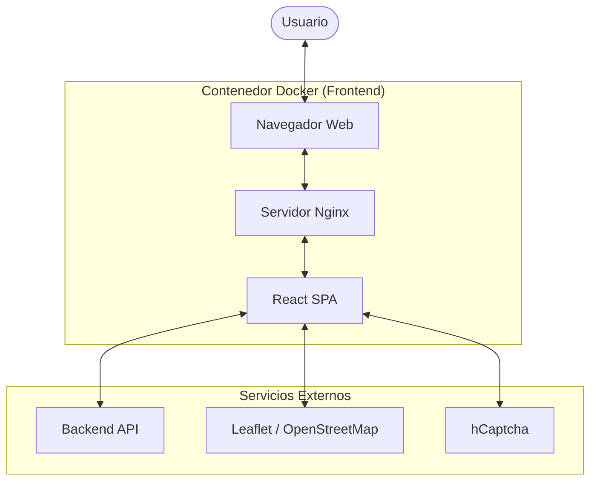
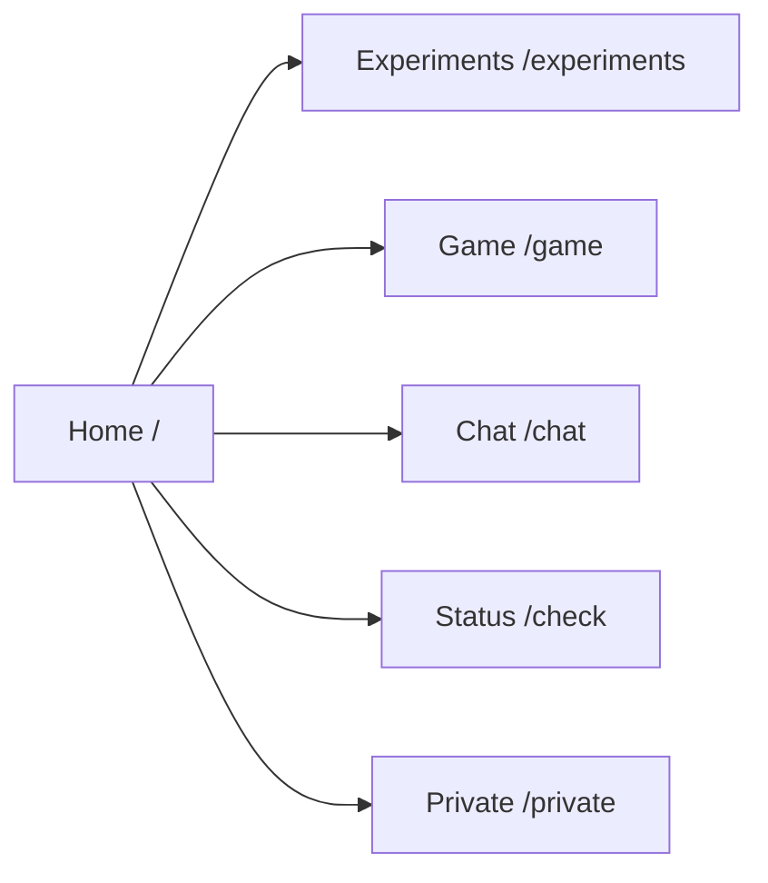
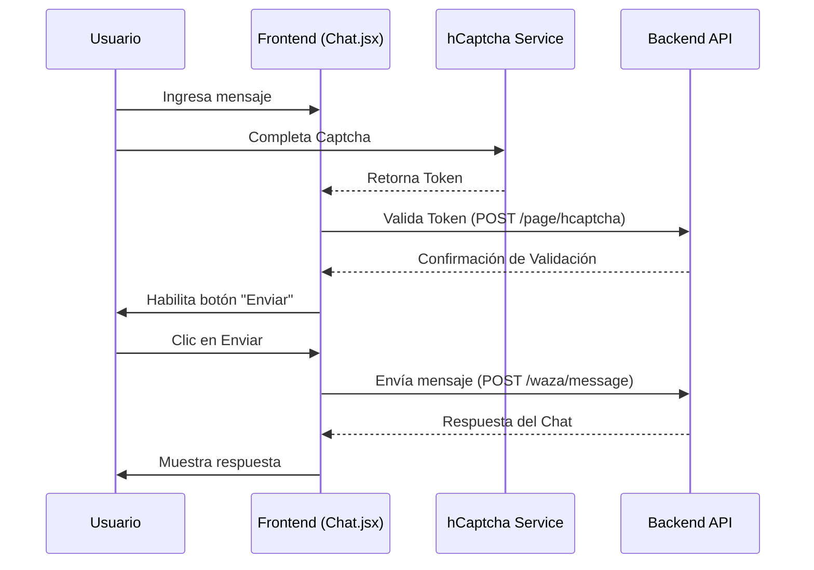
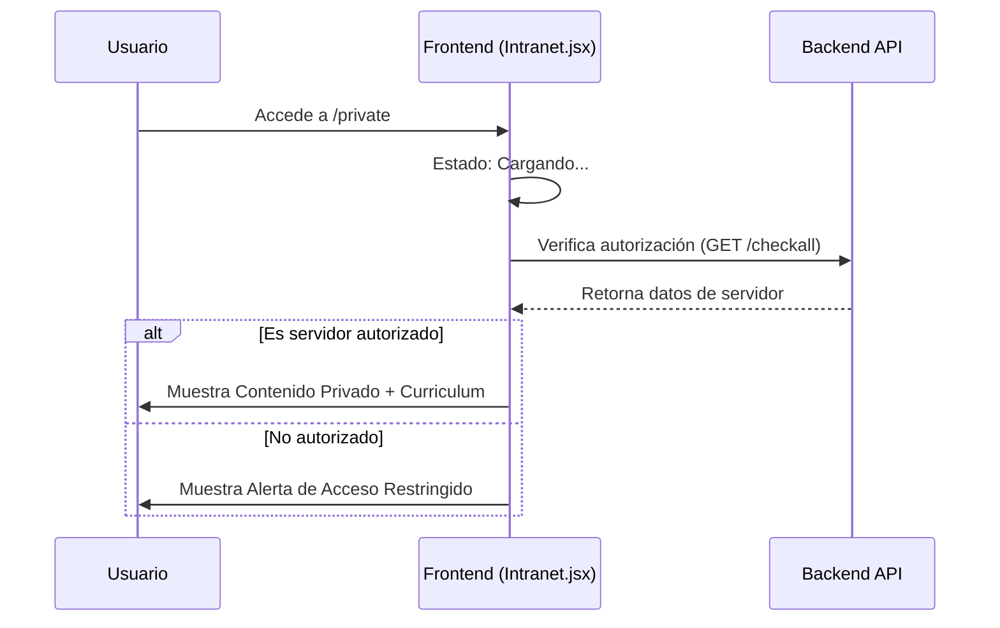
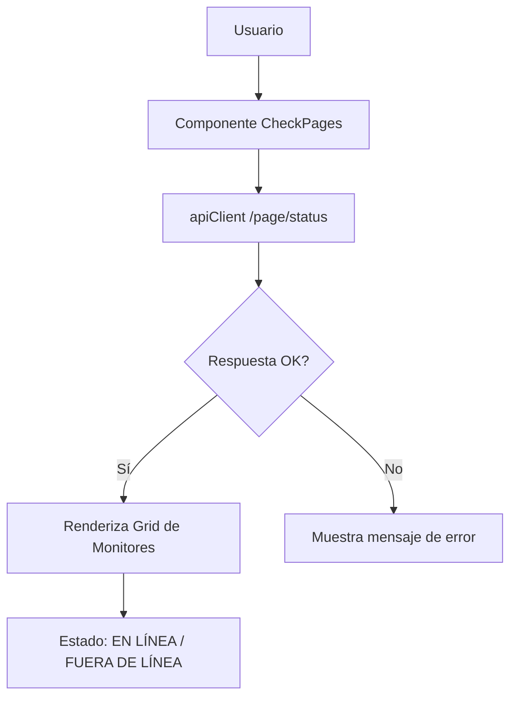

# Website Jonnattan

Este es el proyecto del sitio web personal y portafolio de Jonnattan. Es una aplicación web moderna construida con **React**, **Vite** y **Material UI**, diseñada para mostrar experimentos técnicos, proyectos personales y proporcionar herramientas interactivas.

## 🏗️ Arquitectura del Sistema

El proyecto sigue una arquitectura de Single Page Application (SPA) servida a través de un contenedor Docker con Nginx.



## 🚀 Flujos del Proyecto

### 1. Navegación y Enrutamiento
La aplicación utiliza `react-router-dom` para gestionar la navegación entre las diferentes secciones.



### 2. Flujo de Chat con Verificación (hCaptcha)
Para interactuar con el chat, se requiere una validación de seguridad mediante hCaptcha antes de permitir el envío de mensajes.



### 3. Acceso a Área Privada (Intranet)
El acceso a la sección `/private` está restringido mediante una verificación de servidor.



### 4. Monitoreo de Servicios (Status Check)
Permite visualizar el estado en tiempo real de varios servicios vinculados al ecosistema del proyecto.



## 🛠️ Tecnologías Utilizadas

- **Frontend:** React 18, Vite, Material UI (MUI).
- **Mapas:** Leaflet & React-Leaflet.
- **Gráficos:** Recharts.
- **Seguridad:** hCaptcha.
- **Testing:** Vitest & React Testing Library.
- **Despliegue:** Docker & Nginx.

## 📦 Instalación y Desarrollo

### Requisitos
- Node.js (v18+)
- Docker y Docker Compose (para despliegue)

### Desarrollo Local
1. Instalar dependencias:
   ```bash
   cd jonnapp
   npm install
   ```
2. Iniciar servidor de desarrollo:
   ```bash
   npm run dev
   ```

### Producción con Docker
El proyecto se construye y despliega usando Docker:
```bash
docker-compose up -d --build
```

## ⚙️ Variables de Entorno

El proyecto requiere las siguientes variables configuradas en el entorno (o archivo `.env`):

| Variable | Descripción |
|----------|-------------|
| `VITE_API_BASE_URL` | URL base de la API backend |
| `VITE_HCAPTCHA_SITE_KEY` | Clave de sitio para hCaptcha |
| `VITE_AUTH_JONNA_SERVER` | Credenciales Basic Auth para la API |
| `VITE_PAGE_API_KEY` | API Key principal para las páginas |
| `VITE_GEO_API_KEY` | API Key para servicios geográficos |

---
Desarrollado con ❤️ por Jonnattan.
